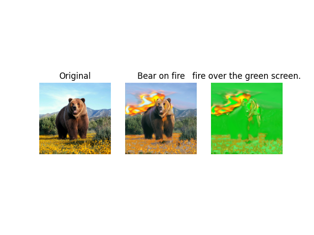

# Text2LIVE

# Introduction
This is Text2LIVE reimplemetation.
Text2LIVE is a method for zero-shot, text-driven appearance manipulation in natural images and videos.
Specifically, given an image and a target text prompt, this method can edit the apperance of existing objects.
This method can perform partial edits by using edits layer that is inspired from chroma keying techniques.

# Results
<p align="center">

</p> 


# Demo

## Requirements
* python 3.8.13
* pytorch 1.11.0
* torchvision 0.12.0
* clip 1.0
* cuda 10.2

## Train
```
> python main.py --train --inference --content-path {Your_image_path} --text {Text_prompt} --tscreen {Text_FOR_SCREEN} --troi {Text_FOR_ROI}
```
Edited images will be saved in ./outs/inference.png.

# References
- [1] Text2LIVE project page
https://text2live.github.io/#paper
- [2] Text2LIVE paper
https://arxiv.org/abs/2204.02491
